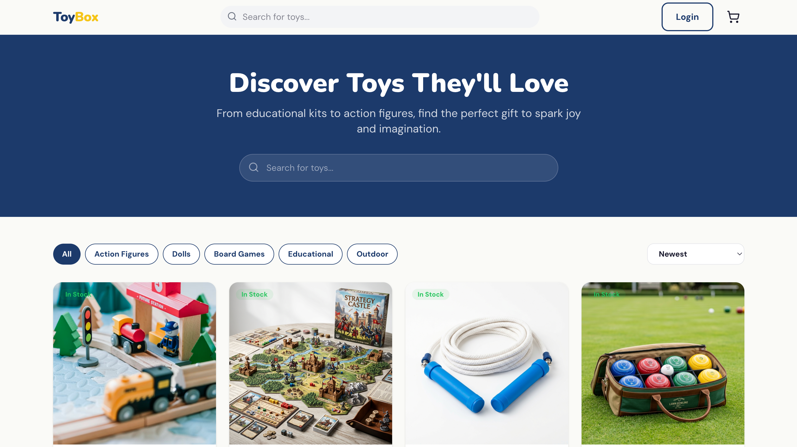
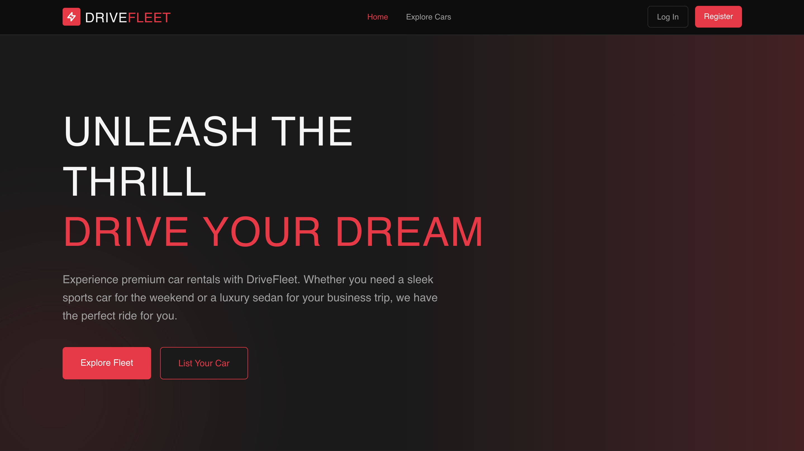
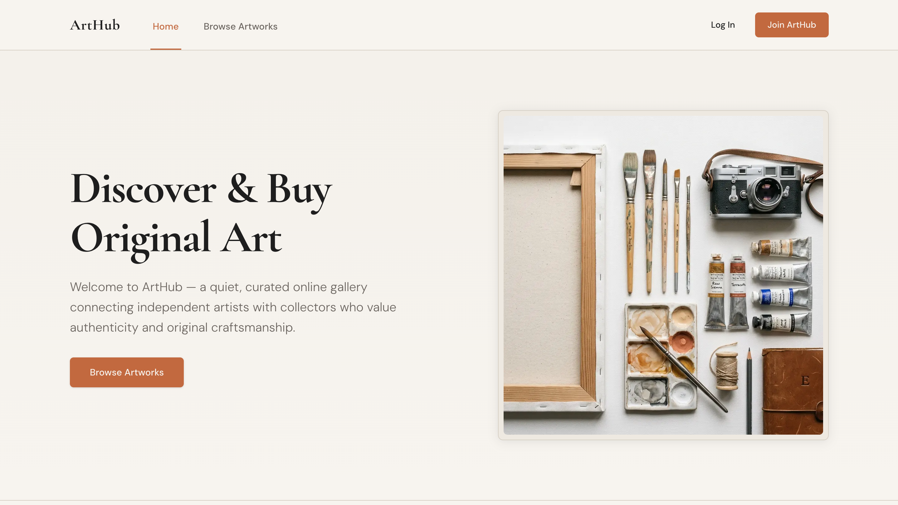

 

## 👋 About Me

I'm a first-year Computer Science & Engineering student at **Chittagong University of Engineering and Technology (CUET)**, building full-stack products from the ground up rather than just following tutorials. My focus is the modern JavaScript stack — Next.js, React, Node.js, and MongoDB — and I like taking projects all the way from database schema to a deployed, working link.

I'm currently building **ArtHub**, a full-stack online art marketplace with role-based auth, Stripe payments, and three separate dashboards, as my capstone project. I'm also actively working toward my first freelance clients.

- 🌱 Learning **Next.js 16 (App Router)**, **HeroUI v3**, and **BetterAuth** in depth through ArtHub
- 🛠️ Building **ArtHub** — a full-stack art marketplace with Stripe subscriptions and JWT auth
- 📚 Solving coursework in Engineering Mathematics, Discrete Mathematics, and C# (CUET CSE curriculum)
- 💼 Exploring a productized freelance service around Next.js SaaS landing pages
- 💬 Ask me about Next.js, React, Express.js, or MongoDB
- ⚡ Fun fact: I write code fluently in three human languages too — Bangla, English, and Hindi

---

## 🧰 Tech Stack

**Latest / currently using most**

 

**Backend & Database**

**Core languages & fundamentals**

**Tools**

---

## 📌 Pinned Projects

<table>
<tr>
<td width="45%">

</td>
<td width="55%" valign="top">

### 🎨 [ArtHub](https://github.com/u2404057-cuet/ArtHub)
Full-stack art marketplace — role-based auth, Stripe subscriptions, and separate artist / admin / user dashboards.

`Next.js 16` `MongoDB` `Stripe` `BetterAuth`

</td>
</tr>
<tr>
<td width="45%">

</td>
<td width="55%" valign="top">

### 🚗 [DriveFleet](https://github.com/u2404057-cuet/ph-assignment-9)
Premium car rental platform with a full booking system and Google OAuth login.

`Next.js` `Express.js` `MongoDB` `Google OAuth`

</td>
</tr>
<tr>
<td width="45%">

</td>
<td width="55%" valign="top">

### 🧸 [Toybox](https://github.com/u2404057-cuet/Toybox)
Toy e-commerce storefront with cart, category filtering, and an admin product dashboard.

`Next.js` `Zustand` `NextAuth.js` `Tailwind CSS`

</td>
</tr>
</table>

> 💡 Pin these three (plus any others you like) from **your GitHub profile → Customize your pins**.

---

## 📊 GitHub Stats

---

## 🔗 Connect With Me

⭐ From <a href="https://github.com/u2404057-cuet">u2404057-cuet</a> — thanks for stopping by!

